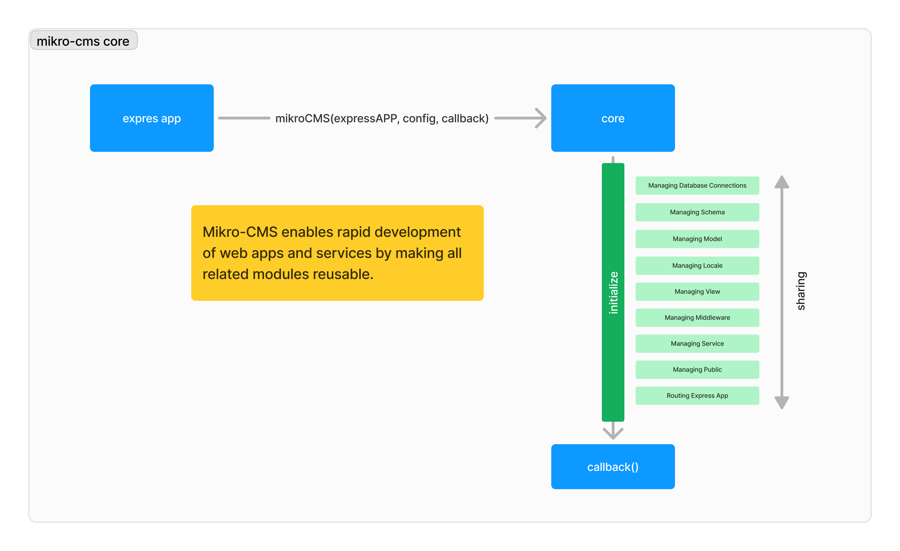

<h1 align="center">mikro-cms core</h1>

The core of the mikro-cms package is the module initialization system. It starts with loading the core on the index of the Express app and passing the configuration.



## Default Module

The important thing about the mikro-cms module is the default module. You must have one module named `default`. When other modules interact with the configuration without specifying the name of the module, they will refer to the `default` module configuration.

```js
module.exports = {
  "default": {
    "database": {},
    "schema": {},
    "model": {},
    "locale": {},
    "middleware": {},
    "router": {},
    "service": [],
    "public": {}
  }
}
```

## Configuration

Configuration contains all the modules we have and passes them into mikro-cms initialization. The configuration can be stored in a separate file or included directly:

```js
module.exports = {
  "module_name": {
    "database": {},
    "schema": {},
    "model": {},
    "locale": {},
    "middleware": {},
    "router": {},
    "service": [],
    "public": {}
  }
}
```

### Database Configuration

Managing database connections efficiently is crucial for the performance and scalability of your application. The configuration file for mikro-cms allows you to define multiple database connections in a centralized manner. The database used by mikro-cms utilizes the Sequelize package. The database configuration references [Sequelize](https://www.npmjs.com/package/sequelize):

```js
"database": {
  "connection_name": {
    "database": "name_of_database",
    "username": "username_of_user",
    "password": "password_of_user",
    "sequelize": {
      "host": "hostname",
      "port": "port",
      "dialect": "mysql"
      // other Sequelize configurations
    }
  }
}
```

### Schema Configuration

The schema configuration defines the structure of your database tables using Sequelize models. Each model represents a table in your database:

```js
"schema": {
  "schema_name": {
    "connection": "name of the database connection",
    "structure": require("path_to_schema_file")
  }
}
```

Schema file:

```js
function (DataTypes) {
  return {
    attributes: {
      // defining the fields of the model
    },
    options: {
      tableName: "name_of_table",
      // other Sequelize schema options
    }
  };
}
```

### Model Configuration

Models contain all methods callable by our service and other models to process queries to the database tables. We can also define schema relationships within the migration method.

```js
"model": {
  "model_name": require("path_to_model_file")
}
```

Model file:

```js
function (db, schema, model) {
  function migration() {
    // Define migrations here
  }

  return {
    migration,
    // other model methods
  };
}
```

### Locale Configuration

Web localization is the process of adapting a website or web application to different languages and regions, making it suitable for users from various cultural backgrounds:

```js
"locale": {
  "language_code": require("path_to_locale_file")
}
```

Locale file:

```js
module.exports = {
  “locale_id”: “locale format string”
}
```

### Middleware Configuration

The middleware configuration defines methods to intercept requests.

```js
"middleware": {
  "middleware_name": require("path_to_middleware_file")
}
```

Middleware file:

```js
function (model, locale) {
  return function (req, res, next) {
    // Middleware logic goes here

    next();
  };
}
```

### Router Configuration

Express Router is a built-in feature of the Express.js framework that allows you to create modular, mountable route handlers. It is a powerful tool for organizing your application’s routing logic, making your code more modular and easier to maintain.

```js
"router": {
  "endpoint": [
    "middleware name" or ["module name", "middleware name"]
  ]
}
```

###  Service Configuration

In the context of Express.js, an Express handler is a function that processes HTTP requests and sends back a response. In mikro-cms we refer to this as a service, which is used to manage incoming requests and control how the server responds.

```js
"service": [
  {
    "router": "endpoint of router" or ["module name", "endpoint of router"],
    "handler": {
      "endpoint": {
        "method": "HTTP Method",
        "handler": require("path_to_service_file")
      }
    }
  }
]
```

Service file:

```js
function (model, locale) {
  return [
    // all handler methods
  ];
}
```

### Public Configuration

These files are directly accessible by the client (e.g., web browsers) without any server-side processing.

Configuration format:

```js
"public": {
  "endpoint": {
    "middleware": [
      "middleware name" or ["module name", "middleware name"]
    ],
    "path": "path_to_your_public_directories"
  }
}
```

## Read more documentation

- [Getting Started](./docs/started.md)
- [Make a Configuration](./docs/configuration.md)
- [Developing a Module](./docs/module.md)
